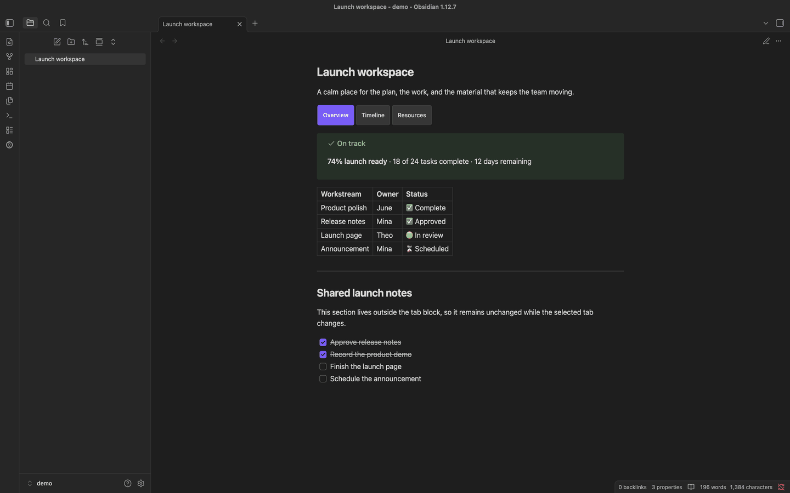

# Just Tabs

Put related Markdown, queries, and embeds into compact, accessible tabs without turning your Obsidian notes into custom pages.



## Features

- Author tabs in ordinary Markdown with a fenced `tabs` block.
- Render Markdown, links, embeds, callouts, math, Mermaid, and compatible community-plugin processors through Obsidian's Markdown pipeline.
- Use interactive tabs in Reading View and outside the editing locus in Live Preview; keep raw Markdown in Source Mode.
- Preserve visited panels during normal switching and refresh stale hidden panels after relevant vault or metadata changes.
- Inherit the active Obsidian theme, with five optional Style Settings controls.
- Navigate with pointer, touch, or keyboard using accessible tab semantics.
- Keep malformed source visible in a diagnostic instead of silently discarding it.

## Syntax

Start each tab with a column-zero `--- tab: <label>` marker. A block needs at least two non-empty, unique labels.

`````markdown
````tabs
--- tab: Greedy

Greedy chooses the largest usable coin.

--- tab: Dynamic programming

```dataview
TABLE file.mtime
FROM "Algorithms"
```
````
`````

The outer fence must be longer than every Markdown fence inside it. The example uses four backticks outside and three around the Dataview query. Increase the outer fence again if a tab body contains a longer fence.

The first tab starts active. Empty tab bodies are valid. To render a literal marker-looking line, escape it as `\--- tab:`. Nested `tabs` blocks and per-block configuration are not supported.

## Obsidian modes

| Mode | Behavior |
| --- | --- |
| Reading View | Interactive tabs on desktop and mobile. Switching tabs never edits the note. |
| Live Preview | Interactive tabs while the editing locus is outside the block; fenced source while editing inside it. |
| Source Mode | Raw fenced Markdown only. |

## Installation

### Community Plugins

Use this route after Just Tabs is listed in Obsidian's Community Plugins directory:

1. Open **Settings → Community plugins**.
2. Select **Browse**, search for **Just Tabs**, then select **Install**.
3. Select **Enable**.

### BRAT

Published releases and prereleases can be installed with [BRAT](https://github.com/TfTHacker/obsidian42-brat):

1. Install and enable **Obsidian42 - BRAT** from Community Plugins.
2. Run **BRAT: Add a beta plugin for testing** from the command palette.
3. Enter `grafanaKibana/obsidian-just-tabs`.
4. Enable **Just Tabs** under **Settings → Community plugins**.

BRAT can install only a published release or prerelease, not an unpublished draft.

### Manual installation

1. Download `main.js`, `manifest.json`, and `styles.css` from the same [GitHub Release](https://github.com/grafanaKibana/obsidian-just-tabs/releases).
2. Create `<Vault>/.obsidian/plugins/just-tabs/`.
3. Copy the three downloaded files directly into that directory.
4. Reload Obsidian.
5. Enable **Just Tabs** under **Settings → Community plugins**.

Do not mix assets from different releases.

## Compatibility and freshness

Just Tabs sends raw tab bodies through Obsidian's Markdown renderer. It does not sanitize content, whitelist block types, or maintain plugin-specific adapters. This provides broad pipeline compatibility, not a guarantee for every current or future community plugin.

Visited panels stay mounted while current. When a hidden panel becomes stale after a relevant public vault or metadata event, Just Tabs rebuilds it once on reactivation. This keeps a hidden Dataview panel current after indexed vault changes. Visible processors continue to manage their normal refresh behavior; network-, clock-, or private-state-driven updates remain that processor's responsibility.

## Style Settings

Just Tabs works without [Style Settings](https://github.com/mgmeyers/obsidian-style-settings). If Style Settings is installed, it exposes appearance controls like:

- Density: compact, default, or comfortable
- Tab alignment: start, center, or equal width
- Gap between tabs
- Corner radius
- Content spacing below the tab list

Colors, typography, borders, accents, and focus styling continue to come from the active Obsidian theme.

## CSS snippets

For further customization, open **Settings → Appearance → CSS snippets**, select the folder icon, and create `just-tabs.css`. Add only the rules you want to override:

```css
.just-tabs {
	--just-tabs-gap: 0.5rem;
	--just-tabs-radius: 999px;
	--just-tabs-content-spacing: 1rem;
}

.just-tabs__tab {
	background-color: var(--background-secondary);
	color: var(--text-muted);
}

.just-tabs__tab[aria-selected="true"] {
	background-color: var(--interactive-accent);
	color: var(--text-on-accent);
}
```

Return to **CSS snippets**, select **Reload snippets**, and enable `just-tabs`. Theme changes may require adjusting these overrides.

## Templater

Templater can generate ordinary `tabs` Markdown before Just Tabs renders it. There is no runtime integration or load-order adapter. Copy the [static or prompt-driven templates](docs/templater.md).

## Keyboard and accessibility

Just Tabs uses `tablist`, `tab`, and `tabpanel` semantics with linked ARIA relationships and one keyboard tab stop in each tab list.

- **Left/Right Arrow** moves focus between tab labels and wraps at the ends.
- **Home/End** moves focus to the first or last label.
- **Enter/Space** activates the focused tab.
- Pointer or touch activates the selected tab directly.

Keyboard focus remains visible, hidden panels stay out of the accessibility tree, reduced-motion preferences are respected, and the active tab scrolls into view when the tab list overflows.

## Troubleshooting

### I see fenced source instead of tabs

- Enable Just Tabs under **Settings → Community plugins**.
- Reading View renders tabs. Source Mode intentionally stays raw.
- In Live Preview, move the editing locus outside the fenced block.
- Tap or click non-interactive tab content to move the editing locus back into the fenced source; tab buttons, links, media, and embedded controls remain interactive.
- Confirm the fence identifier is exactly `tabs`.

### I see a diagnostic

Confirm that markers start at column zero, labels are non-empty and unique, the block has at least two tabs, and no content appears before the first marker. Nested `tabs` blocks are rejected. The diagnostic preserves the source so it can be corrected.

### A nested code block closes the tabs block

Make the outer backtick fence longer than the longest fence in any tab body.

### A link or embed does not resolve

First test the same Markdown outside a `tabs` block in the same note. Just Tabs passes the containing note's source path to Obsidian. If the outside copy also fails, fix the link or processor configuration there first.

### A community-plugin block does not render or refresh

Test it outside Just Tabs. Reactivate a hidden stale tab after a vault or metadata change. Just Tabs does not force visible processors to refresh or add plugin-specific adapters.

### Tabs overflow on a small screen

Scroll the tab list horizontally. The list should contain its own overflow without widening the note; report a reproducible failure with the device, Obsidian version, theme, and source block.

## Development and releases

- [Contributing and local development](CONTRIBUTING.md)
- [Issues](https://github.com/grafanaKibana/obsidian-just-tabs/issues)
- [Releases and changelog](https://github.com/grafanaKibana/obsidian-just-tabs/releases)

Just Tabs runs locally. It makes no network requests, collects no client-side or server-side telemetry, requires no external account or payment, displays no advertising, accesses no files outside the Obsidian vault, and includes no closed-source components.

## License

[MIT](LICENSE)
