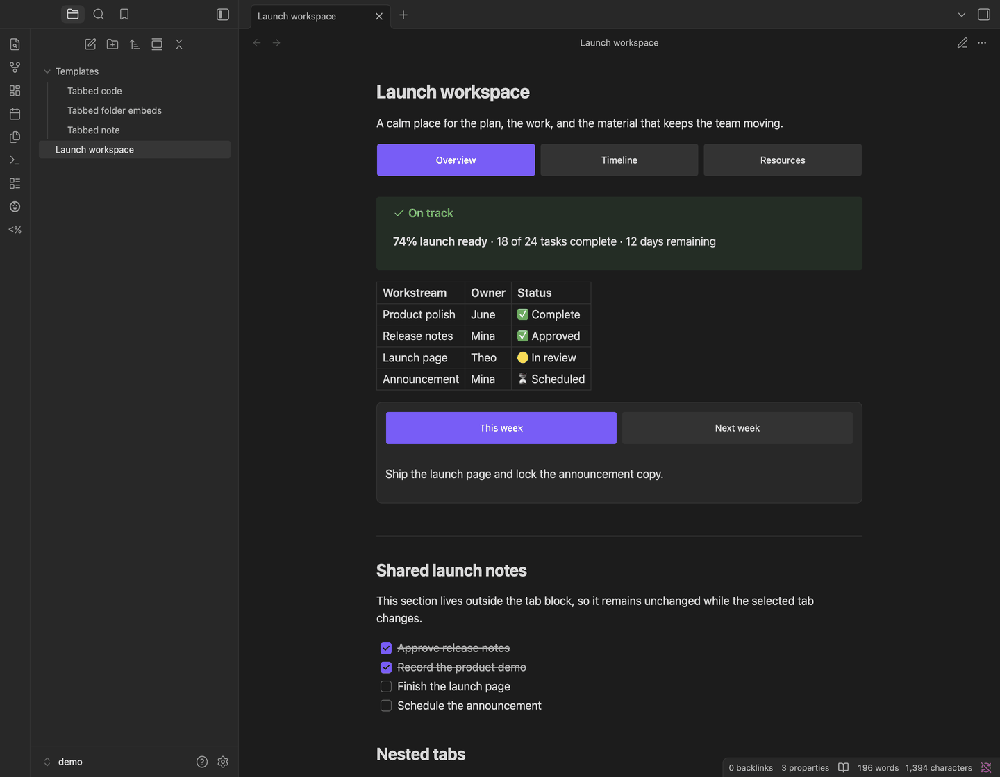

# Tabsdown

Put related Markdown, queries, and embeds into compact, accessible tabs without turning your Obsidian notes into custom pages.



## Features

- Author tabs in ordinary Markdown with a fenced `tabsdown` block.
- Render Markdown, links, embeds, callouts, math, Mermaid, and compatible community-plugin processors through Obsidian's Markdown pipeline.
- Use interactive tabs in Reading View and outside the editing locus in Live Preview; keep raw Markdown in Source Mode.
- Preserve visited panels during normal switching and refresh stale hidden panels after relevant vault or metadata changes.
- Label tabs with any bundled Lucide icon.
- Inherit the active Obsidian theme, with five optional Style Settings controls.
- Navigate with pointer, touch, or keyboard using accessible tab semantics.
- Keep malformed source visible in a diagnostic instead of silently discarding it.

## Syntax

Start each tab with a column-zero `tab: <label>` marker. A block needs at least two non-empty, unique labels. Put optional block configuration on a column-zero `config: <values>` line before the first tab, such as `config: top, multi`; later position or layout values win.

`````markdown
````tabsdown
tab: Greedy

Greedy chooses the largest usable coin.

tab: Dynamic programming

```dataview
TABLE file.mtime
FROM "Algorithms"
```
````
`````

Use matching backtick or tilde fences. The outer fence must be longer than every same-character Markdown fence inside it. The example uses four backticks outside and three around the Dataview query. Increase the outer fence again if a tab body contains a longer fence.

````markdown
~~~tabsdown
config: top, multi

tab: Python
print("Hello Tabsdown")

tab: JavaScript
console.log("Hello Tabsdown");
~~~
````

`top`, `left`, `right`, and `bottom` place the tab list; `one` keeps it on one scrollable line and `multi` wraps labels. The first tab starts active. Empty tab bodies are valid. To render a literal marker-looking line, escape it as `\tab:`.

### Icons

Start a label with `icon:<name>` to put one of Obsidian's bundled [Lucide](https://lucide.dev/icons/) icons before it:

````markdown
```tabsdown
tab: icon:code Python
tab: icon:file-text Notes
```
````

An unknown name renders nothing, and every tab still needs a label. Escape a literal label as `tab: \icon:name`.

### Nested tabs

A tab body can hold another `tabsdown` block, as long as its fence is shorter than the one around it:

`````markdown
````tabsdown
tab: Backend

```tabsdown
tab: Python
tab: Go
```

tab: Frontend
`````

Markers inside a nested block belong to that block, so the inner `tab:` lines above do not split the outer one and need no escaping. Each level places its own tab list and keeps its own active tab; a `config:` line applies only to the level that declares it.

## Obsidian modes

| Mode | Behavior |
| --- | --- |
| Reading View | Interactive tabs on desktop and mobile. Switching tabs never edits the note. |
| Live Preview | Interactive tabs while the editing locus is outside the block; fenced source while editing inside it. |
| Source Mode | Raw fenced Markdown only. |

## Installation

### Community Plugins

Use this route after Tabsdown is listed in Obsidian's Community Plugins directory:

1. Open **Settings → Community plugins**.
2. Select **Browse**, search for **Tabsdown**, then select **Install**.
3. Select **Enable**.

### BRAT

Published releases and prereleases can be installed with [BRAT](https://github.com/TfTHacker/obsidian42-brat):

1. Install and enable **Obsidian42 - BRAT** from Community Plugins.
2. Run **BRAT: Add a beta plugin for testing** from the command palette.
3. Enter `grafanaKibana/obsidian-tabsdown`.
4. Enable **Tabsdown** under **Settings → Community plugins**.

BRAT can install only a published release or prerelease, not an unpublished draft.

### Manual installation

1. Download `main.js`, `manifest.json`, and `styles.css` from the same [GitHub Release](https://github.com/grafanaKibana/obsidian-tabsdown/releases).
2. Create `<Vault>/.obsidian/plugins/tabsdown/`.
3. Copy the three downloaded files directly into that directory.
4. Reload Obsidian.
5. Enable **Tabsdown** under **Settings → Community plugins**.

Do not mix assets from different releases.

## Compatibility and freshness

Tabsdown sends raw tab bodies through Obsidian's Markdown renderer. It does not sanitize content, whitelist block types, or maintain plugin-specific adapters. This provides broad pipeline compatibility, not a guarantee for every current or future community plugin.

Visited panels stay mounted while current. When a hidden panel becomes stale after a relevant public vault or metadata event, Tabsdown rebuilds it once on reactivation. This keeps a hidden Dataview panel current after indexed vault changes. Visible processors continue to manage their normal refresh behavior; network-, clock-, or private-state-driven updates remain that processor's responsibility.

## Publishing with Quartz

Obsidian renders these blocks; a static site generator does not. [quartz-tabsdown](https://github.com/grafanaKibana/quartz-tabsdown) is a separate [Quartz](https://quartz.jzhao.xyz/) plugin that reads the same syntax, so a vault published with Quartz shows tabs rather than a fenced code block:

```bash
npx quartz plugin add github:grafanaKibana/quartz-tabsdown
```

It shares this repository's parser and defaults to the same appearance values as the Style Settings controls below. Interactive tabs there need JavaScript; without it every panel renders in order under its own label.

## Embedding tabs from another plugin

Fenced blocks are not the only way in. A plugin that already owns live DOM panels can hand them to Tabsdown and get the same styling, animation, and accessibility without re-rendering anything through Markdown:

```ts
interface TabsdownApi {
  mountTabs(
    container: HTMLElement,
    options: {
      label: string;
      selection?: string | null;
      tabs: readonly {
        id: string;
        label: string;
        panel: HTMLElement;
      }[];
      onSelectionChange?: (
        selection: string | null,
        previous: string | null,
      ) => void;
    },
  ): {
    readonly selection: string | null;
    setSelection(id: string | null): void;
    setAvailable(id: string, available: boolean): void;
    destroy(): void;
  };
}

const tabsdown = this.app.plugins.getPlugin("tabsdown") as TabsdownApi | null;
const tabs = tabsdown?.mountTabs(container, {
  label: "Trace and watch",
  selection: null,
  tabs: [
    { id: "trace", label: "Trace", panel: traceElement },
    { id: "watch", label: "Watch", panel: watchElement },
  ],
  onSelectionChange(selection) {
    // null when the open panel was collapsed
  },
});

tabs?.setSelection("trace");
tabs?.setAvailable("watch", false);
tabs?.destroy();
```

This is a collapsible switch, not a tab strip: selection starts at `null` unless you pass one, and activating the open tab closes it again. At most one panel is ever visible. Fenced `tabsdown` blocks are unaffected and keep their first-tab-selected, always-one-open behavior.

- **Your panels stay yours.** They are moved, never cloned or re-rendered. `destroy()` returns them to `container` with their original `id`, `role`, `tabindex`, `hidden`, and `aria-labelledby` restored, and removes everything Tabsdown added. It is safe to call twice, and the plugin calls it for you if Tabsdown is disabled first.
- **Keyboard and screen readers.** Buttons are real `<button>` elements, so Enter, Space, and Tab behave natively and focus stays put. The group is not announced as a tab list, because nothing is selected at first. If you make the focused tab unavailable, focus moves to the next one rather than to the top of the document. Panels are named and given a tab stop only where they need one: a panel that already carries `aria-label` or `aria-labelledby` keeps its own name, and one containing its own controls is left out of the tab order so those controls come first.
- **Place focus yourself after `destroy()`.** Tabsdown does not move it. While the group is live it rehomes focus for you, but teardown removes the buttons and the root, and only you know what replaces them — so if you tear down in response to something the reader did, focus the element that should come next.
- **`onSelectionChange` reports user intent only.** It fires on click and when hiding a tab forces the panel closed, not on mount and not on your own `setSelection` calls, so you will not echo your own updates. Calling back into the controller from the handler is safe.
- **Mount into the document.** A detached container has no resolved styles, so the height animation falls back to a fixed duration and ignores the reader's reduced-motion setting.
- **Do not mount inside a rendered `tabsdown` panel.** That panel is rebuilt from Markdown when its content goes stale, which would discard your root without tearing it down.

## Style Settings

Tabsdown works without [Style Settings](https://github.com/mgmeyers/obsidian-style-settings). If Style Settings is installed, it exposes appearance controls like:

- Size: default or compact
- Personality: default or underline
- Overflow behavior: scroll or wrap
- Palette: primary or secondary
- Accent: optional override, with the active theme accent used by default
- Tab alignment: start, center, or equal width
- Gap between tabs
- Corner radius
- Content spacing below the tab list

Colors, typography, borders, accents, and focus styling continue to come from the active Obsidian theme.

## CSS snippets

For further customization, open **Settings → Appearance → CSS snippets**, select the folder icon, and create `tabsdown.css`. Add only the rules you want to override:

```css
.tabsdown {
	--tabsdown-gap: 0.5rem;
	--tabsdown-radius: 999px;
	--tabsdown-content-spacing: 1rem;
}

.tabsdown__tab {
	background-color: var(--background-secondary);
	color: var(--text-muted);
}

.tabsdown__tab[aria-selected="true"] {
	background-color: var(--interactive-accent);
	color: var(--text-on-accent);
}
```

Return to **CSS snippets**, select **Reload snippets**, and enable `tabsdown`. Theme changes may require adjusting these overrides.

## Templater

Templater can generate ordinary `tabsdown` Markdown before Tabsdown renders it. There is no runtime integration or load-order adapter. Copy the [static or prompt-driven templates](docs/templater.md).

## Keyboard and accessibility

Tabsdown uses `tablist`, `tab`, and `tabpanel` semantics with linked ARIA relationships and one keyboard tab stop in each tab list.

- **Left/Right Arrow** moves focus between tab labels and wraps at the ends.
- **Home/End** moves focus to the first or last label.
- **Enter/Space** activates the focused tab.
- Pointer or touch activates the selected tab directly.

Keyboard focus remains visible, hidden panels stay out of the accessibility tree, reduced-motion preferences are respected, and the active tab scrolls into view when the tab list overflows.

## Troubleshooting

### I see fenced source instead of tabs

- Enable Tabsdown under **Settings → Community plugins**.
- Reading View renders tabs. Source Mode intentionally stays raw.
- In Live Preview, move the editing locus outside the fenced block.
- Tap or click non-interactive tab content to move the editing locus back into the fenced source; tab buttons, links, media, and embedded controls remain interactive.
- Confirm the fence identifier is exactly `tabsdown`.

### I see a diagnostic

Confirm that markers start at column zero, labels are non-empty and unique, the block has at least two tabs, and no content appears before the first marker. A nested block that is never closed reports its opening line, because it swallows every marker after it. The diagnostic preserves the source so it can be corrected.

### A nested code block closes the Tabsdown block

Make the outer fence longer than the longest same-character fence in any tab body. Tilde fences work too.

### A link or embed does not resolve

First test the same Markdown outside a `tabsdown` block in the same note. Tabsdown passes the containing note's source path to Obsidian. If the outside copy also fails, fix the link or processor configuration there first.

### A community-plugin block does not render or refresh

Test it outside Tabsdown. Reactivate a hidden stale tab after a vault or metadata change. Tabsdown does not force visible processors to refresh or add plugin-specific adapters.

### Tabs overflow on a small screen

Scroll the tab list horizontally. The list should contain its own overflow without widening the note; report a reproducible failure with the device, Obsidian version, theme, and source block.

## Development and releases

- [Contributing and local development](CONTRIBUTING.md)
- [Issues](https://github.com/grafanaKibana/obsidian-tabsdown/issues)
- [Releases and changelog](https://github.com/grafanaKibana/obsidian-tabsdown/releases)

Tabsdown runs locally. It makes no network requests, collects no client-side or server-side telemetry, requires no external account or payment, displays no advertising, accesses no files outside the Obsidian vault, and includes no closed-source components.

## License

[MIT](LICENSE)
