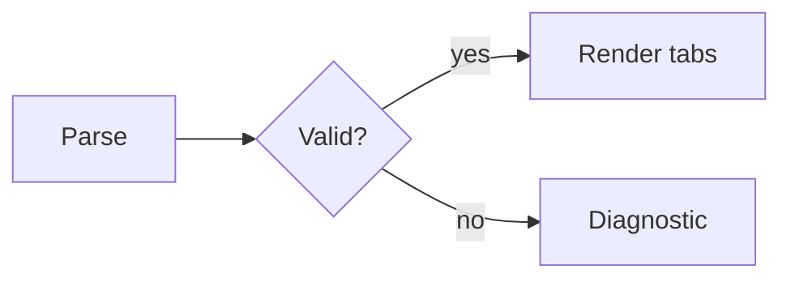

---
tags:
  - test
---

# Tabsdown test matrix

Every syntax and rendering variation in one note. Open in Reading View. Not pretty on purpose.

## Style Settings QA

Reuse the Positions, Icons, and Labels sections below while changing settings; no duplicate blocks are needed.

| Check | Expected |
| --- | --- |
| Leave every Top/Bottom/Left/Right override on **Inherit defaults**, then change each global Personality, Palette, and Alignment value. | All four positions follow the globals; any `mountTabs` demo remains global-only. |
| Reverse each global with one position: Underline → Button, Button → Underline, Secondary → Primary, Start/Center → Equal width, and Equal width → Start/Center. | Only that position changes, nested blocks keep their own position, and Left/Right tabs do not stretch vertically. Repeat Left/Right above and below the 28rem container threshold. |
| Try underline thickness 1/2/8, hover selected and unselected tabs, gap 0/48 in Scroll/Wrap, content spacing 0/12/48, and selected weight Theme default/Medium/Bold. | The default indicator is 2px; unselected hover changes only the underline color and readable text without changing its width; selected hover keeps its configured underline; Wrap uses half the gap; spacing appears exactly once; only selected/expanded labels change weight. |
| Change horizontal padding directly to 0/36/48 in Default and Compact. | Each slider change applies immediately without a separate toggle and overflow remains usable. |
| Change side-list width directly to 96/160/320 on Left/Right and resize narrowly. | Each slider change applies immediately on wide lists; narrow lists return to a full-width row and panels remain visible. |
| Set icon size 12/32 and spacing 0/16, using the Icons section. | Icon boxes and gaps change without moving plain-label tabs off baseline. |
| Use the long Labels block with Scroll, Wrap, Equal width, Left/Right, and narrow panes. | Equal width shares spare space without squeezing labels: Scroll scrolls and Wrap moves whole tabs to another row; panels never collapse to zero. |
| Toggle theme button outline and test mouse hover, keyboard focus, touch taps, reduced motion, light/dark themes, and rapid setting changes. | Theme shadow toggles without replacing the focus outline; hover never sticks on touch; motion and selected state remain correct. |

## 1. Positions

```tabsdown
config: top

tab: Installation notes
top / first
tab: Configuration reference
top / second
tab: Migration from version one
top / third
```

```tabsdown
config: left

tab: Installation notes
left / first
tab: Configuration reference
left / second
tab: Migration from version one
left / third
tab: Troubleshooting a failed sync
left / fourth
```

```tabsdown
config: right

tab: Installation notes
right / first
tab: Configuration reference
right / second
tab: Migration from version one
right / third
tab: Troubleshooting a failed sync
right / fourth
```

```tabsdown
config: bottom

tab: Installation notes
bottom / first
tab: Configuration reference
bottom / second
tab: Migration from version one
bottom / third
```

## 2. Overflow: one vs multi

```tabsdown
config: one

tab: Authentication and sessions
one
tab: Background job scheduling
one
tab: Content addressable storage
one
tab: Distributed tracing spans
one
tab: Eventual consistency notes
one
tab: Feature flag rollout plan
one
```

```tabsdown
config: multi

tab: Authentication and sessions
multi
tab: Background job scheduling
multi
tab: Content addressable storage
multi
tab: Distributed tracing spans
multi
tab: Eventual consistency notes
multi
tab: Feature flag rollout plan
multi
```

## 3. Config precedence

Later position and layout values win: expect `bottom` + `multi`.

```tabsdown
config: top, one
config: left
config: bottom, multi

tab: Resolved position and layout
bottom, multi
tab: Second panel
second
```

Single line, reversed order, whitespace around values.

```tabsdown
config:  multi ,  right

tab: Resolved position and layout
right, multi
tab: Second panel with a much longer label
second
```

## 4. Icons

```tabsdown
tab: icon:code Code
valid icon
tab: icon:file-text Notes
valid icon
tab: icon:not-a-real-icon-name Unknown
unknown icon renders nothing, label stays
tab: No icon
plain label
tab: icon:git-branch ✅ Unicode ✨ 中文 label
unicode after icon
```

Escaped icon token — label should read literally `icon:code Not an icon`.

```tabsdown
tab: \icon:code Not an icon
escaped icon token
tab: Second panel
second
```

## 5. Labels

```tabsdown
tab: A very long label that should force the tab list to overflow or wrap depending on the layout value
long
tab: **not bold** `not code` [not a link](https://example.com)
markdown in labels is literal text
tab: 1
short
tab: ・
punctuation only
```

## 6. Bodies

Empty and whitespace-only bodies are valid.

```tabsdown
tab: Empty
tab: Whitespace only

   
tab: Has content
content
```

Mixed Markdown, one tab per feature.

`````tabsdown
tab: Headings + text

# H1
## H2
### H3

Paragraph with **bold**, *italic*, `code`, [external link](https://obsidian.md), and a footnote[^1].

[^1]: Footnote body inside a tab panel.

tab: Lists

- bullet
- bullet
  - nested
    - deeper
1. ordered
2. ordered

- [ ] task open
- [x] task done

tab: Table

| Left | Center | Right |
| :--- | :----: | ----: |
| a | b | c |
| longer cell content to force horizontal pressure | b | c |

tab: Callouts

> [!info] Info
> Body.

> [!warning]- Collapsed warning
> Hidden until expanded.

> [!quote] Nested
> > [!tip] Inner
> > Inner body.

tab: Code fences

```js
const tabsdown = { fence: "backtick" };
console.log(tabsdown);
```

~~~python
print("tilde fence inside a backtick tabsdown block")
~~~

    indented code block

tab: Math

Inline $E = mc^2$ and block:

$$
\sum_{i=1}^{n} i = \frac{n(n+1)}{2}
$$

tab: Mermaid



tab: Links + embeds

- resolved: [[Launch workspace]]
- unresolved: [[No such note here]]
- heading link: [[Launch workspace#Shared launch notes]]
- embed: ![[Launch workspace#Shared launch notes]]
- external image: 

tab: HTML + raw

<div style="border: 1px solid var(--text-accent); padding: 4px;">
  raw HTML div
</div>

<details><summary>details/summary</summary>body</details>

Horizontal rule:

---

tab: Tall panel

Line 1
Line 2
Line 3
Line 4
Line 5
Line 6
Line 7
Line 8
Line 9
Line 10
Line 11
Line 12
Line 13
Line 14
Line 15
Line 16
Line 17
Line 18
Line 19
Line 20

tab: Short panel

One line. Switching between this and the tall panel exercises the height animation.
`````

## 7. Escaped markers

Literal `tab:` and `config:` lines inside a body.

```tabsdown
tab: Escaped marker
\tab: this line is body text, not a tab
still body

tab: Config-looking body
config: top
above line is body text, not config, because it follows a tab marker
```

## 8. Tilde fences

~~~tabsdown
config: left

tab: Tilde-fenced block
tilde-fenced block
tab: Second panel of the tilde block
second
~~~

## 9. Nesting

Two levels. Each level keeps its own config and active tab.

`````tabsdown
config: top, multi

tab: Outer with a nested block

Outer body before nested block.

````tabsdown
config: left

tab: Middle level, left placed

```tabsdown
config: bottom

tab: Inner level, bottom placed
depth 3
tab: Inner sibling panel
depth 3
```

tab: Middle sibling panel
depth 2
````

Outer body after nested block.

tab: Outer whose body is only a nested block

Nested block as the entire body:

````tabsdown
tab: Nested first panel
first
tab: Nested second panel
second
````

tab: Outer without nesting

No nesting here.
`````

Nested with mixed fence characters.

~~~~tabsdown
tab: Tilde outer fence

```tabsdown
tab: Backtick inner panel
first
tab: Backtick inner sibling
second
```

tab: Tilde outer sibling
second
~~~~

Nested block inside a callout inside a tab.

`````tabsdown
tab: Callout host

> [!info] Nested inside a callout
> ````tabsdown
> tab: Callout nested panel
> first
> tab: Callout nested sibling
> second
> ````

tab: Sibling of the callout host
second
`````

## 10. Stress

Twenty tabs, `one` layout.

```tabsdown
config: one

tab: 01
1
tab: 02
2
tab: 03
3
tab: 04
4
tab: 05
5
tab: 06
6
tab: 07
7
tab: 08
8
tab: 09
9
tab: 10
10
tab: 11
11
tab: 12
12
tab: 13
13
tab: 14
14
tab: 15
15
tab: 16
16
tab: 17
17
tab: 18
18
tab: 19
19
tab: 20
20
```

## 11. Asynchronous content

These fill their panel after the markdown renderer resolves. Switch away and back
between each of them and the short panel, repeatedly: the panels box must hold
the outgoing height until the content lands and then resize once. A collapse to
nothing followed by a spring open is the bug.

The embed row needs no plugins. The query rows need Dataview and Datacore; without
them they render as plain code fences and prove nothing.

`````tabsdown
tab: Embedded note

![[Launch workspace]]

tab: Dataview table

```dataview
TABLE file.mtime AS Modified
FROM ""
SORT file.mtime DESC
LIMIT 15
```

tab: Dataview JS, delayed

```dataviewjs
await new Promise((resolve) => setTimeout(resolve, 800));
dv.list(dv.pages().file.name.slice(0, 10));
```

tab: Datacore

```datacorejsx
return function View() {
	const pages = dc.useQuery("@page");
	return <p>{pages.length} pages indexed</p>;
}
```

tab: Remote image


tab: Short panel

One line. This is the height the tall query panels must not flash through.
`````

Async content inside a nested block: the outer panel resizes while the inner one
is still filling.

`````tabsdown
tab: Outer with a nested query

````tabsdown
tab: Inner query panel

```dataview
LIST
FROM ""
LIMIT 10
```

tab: Inner short panel
one line
````

tab: Outer short panel

One line.
`````

## 12. Diagnostics

Each block below is intentionally invalid and should render a diagnostic with the source preserved.

`too-few-tabs`

```tabsdown
tab: Only one
body
```

`empty-label`

```tabsdown
tab:
body
tab: Second panel
body
```

`duplicate-label`

```tabsdown
tab: Repeated label
first
tab: Repeated label
second
```

`content-before-first-tab`

```tabsdown
stray text before any marker

tab: First panel
first
tab: Second panel
second
```

`invalid-config` — unknown value

```tabsdown
config: sideways

tab: First panel
first
tab: Second panel
second
```

`invalid-config` — empty value list

```tabsdown
config:

tab: First panel
first
tab: Second panel
second
```

`unclosed-nested-block` — reports the opening line of the inner block

`````tabsdown
tab: Outer first panel

````tabsdown
tab: Never closed inner panel
first
tab: Swallowed by the unclosed fence

tab: Also swallowed
third
`````

Config after the first tab is body text, not config, so this renders `top`/`one` with a literal line.

```tabsdown
tab: First panel
first
config: bottom
tab: Second panel
second
```
